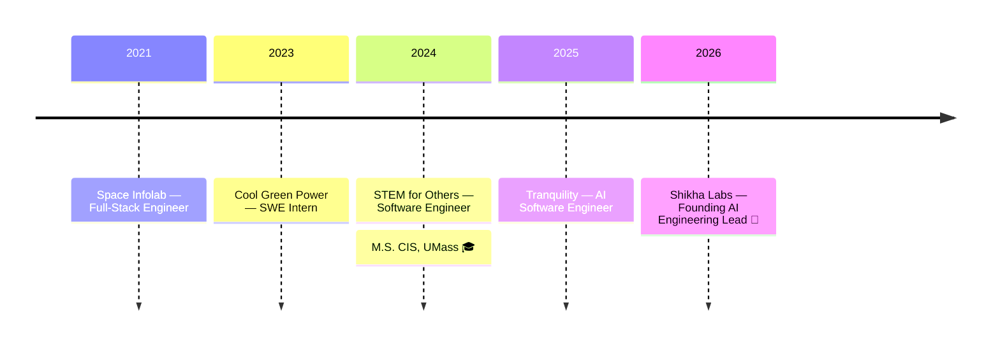

<div align="center">


[](https://www.robinsingh.xyz)

<br/>

<a href="https://www.robinsingh.xyz"></a>
<a href="mailto:robin025.singh@gmail.com"></a>
<a href="https://www.linkedin.com/in/robinsingh-ai/"></a>


</div>


## 🧬 About

```typescript
const robin = {
  role: "Founding AI Full-Stack Engineering Lead @ Shikha Labs 🏫",
  focus: ["LLM workflows", "RAG pipelines", "Real-time backends", "AI interfaces"],
  belief: "Most AI products fail at the interface, not the model 🎯",
};
```


<div align="center">

## 🛠️ Tech Stack


<br/><br/>

<br/><br/>


</div>


<div align="center">

## 🚀 Things I've Shipped

| | Project | What it is | |
|:---:|:---|:---|:---:|
| 🤖 | **[Omni Docs](https://omnidocs.live)** | AI docs assistant — hybrid retrieval, 4× faster answers | `AI/ML` |
| 📝 | **[Notoo](https://notoo.app)** | Browser tools that keep your files on *your* machine | `Local-first` |
| 🎨 | **[AutomataVerse](https://automataverse.com)** | Design & simulate automata — 1,000+ users | `Web` |
| 🥚 | **[Yolk AI](https://apps.apple.com/in/app/yolk-ai-einstein-ai-method/id6736928388)** | AI exam companion, live on the App Store | `Mobile` |
| 📓 | **[Notoo Journal](https://journal.notoo.app/)** | Write in bursts that thread like a conversation | `Product` |
| 🔖 | **[Bookmarkly](https://bookmarkly.notoo.app/)** | Saves the page, not just the address | `Beta` |

✨ **More labs, case studies & writing → [robinsingh.xyz](https://www.robinsingh.xyz)**

</div>


## 💼 Journey




<div align="center">

## 📊 Stats


## 💬 Let's Build Something

[](https://www.robinsingh.xyz)
[](mailto:robin025.singh@gmail.com)
[](https://www.linkedin.com/in/robinsingh-ai/)


</div>
